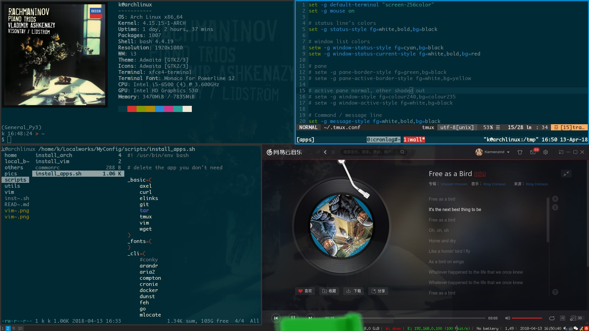
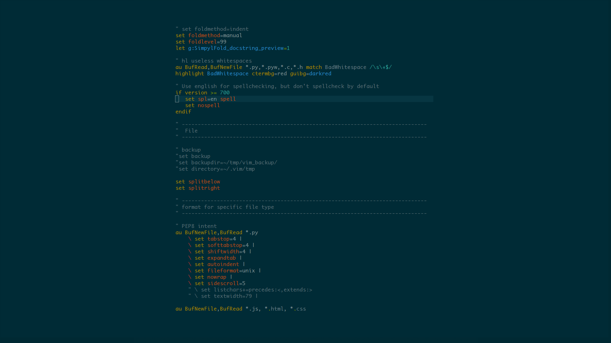

## dotfiles and scripts 

各种配置文件和脚本 
dotfiles and scripts for my ArchLinux

----- 

### 配置和脚本介绍

自己使用的vim、i3wm等软件的配置 
和一些自己写的工具脚本 
主要结构如下 

- [for XDG_CONFIG_DIR](./home/.config)
	- [.vimrc](./vim/.vimrc)
	- [.tmux.conf](./home/.tmux.conf)
    - [aria2](./home/.config/aria2)
    - [compton.conf](./home/.config/compton.conf)
    - [dunst](./home/.config/dunst)
    - [fontconfig](./home/.config/fontconfig)
    - [i3](./home/.config/i3)
    - [volumeicon](./home/.config/volumeicon)
    - [xfce4](./home/.config/xfce4)
- [other config](./others)
	- [bashrc_ext](./others/bashrc_ext)
	- [fcitx](./others/fcitx)
- [personal scripts](./local_bin) :point_left: README
	- [myaria2](./local_bin/myaria2)
	- [acpyve](./local_bin/acpyve)
	- [docker_manager](./local_bin/docker_manager)

> trees are generated by [this script](./utils/build_trees.sh)

-----

### 安装使用

#### ArchLinux的不完整安装脚本

如果你对**ArchLinux安装过程**和**Bash语法**非常熟悉，欢迎使用我的脚本 
Leave it if you are not extremely familiar with the installation of ArchLinux or Bash itself. 
按照安装过程顺序排列

- **[未完成]** [live_cd_part](./scripts/install_arch/live_cd_part.sh) LiveCD部分
- **[未完成]** [chrooted_part](./scripts/install_arch/chrooted_part.sh) chroot之后，取出LiveCD之前
- [graphical_env_part](./scripts/install_arch/graphical_env_part.sh) 安装桌面环境，此处为i3wm

#### 必需/常用软件安装

删除你不需要的软件 
加入`-y`参数可以免确认安装

- [install_apps.sh](./scripts/install_apps.sh)

#### **[未完成]** 载入我的配置 

#### Vim安装

Vim比较特殊，所以单独提出来

- [complete installation](./scripts/install_vim/main.sh) 按照我的Vim配置完整安装
- [compile and install YouCompleteMe](./scripts/install_vim/ycm.sh) YouCompleteMe插件编译安装

----- 

### TODO

- `update.sh` from host to repo... vise versa

-----

### Screenshot

i3 desktop:

vim:

