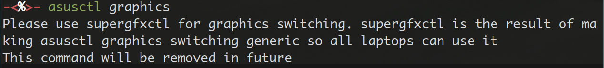

<!-- vim-markdown-toc GFM -->

* [目前状态](#目前状态)
  * [暂未解决问题](#暂未解决问题)
* [Arch安装配置相关](#arch安装配置相关)
  * [EFI分区问题](#efi分区问题)
  * [refind安装配置](#refind安装配置)
  * [图形环境及其它](#图形环境及其它)
* [ASUS官方工具](#asus官方工具)
  * [G14源（不推荐）](#g14源不推荐)
  * [Rog Control Center](#rog-control-center)
  * [asusctl](#asusctl)
  * [supergfxctl](#supergfxctl)
* [键盘相关](#键盘相关)
  * [ROG键召唤Rog Control Center](#rog键召唤rog-control-center)
* [已（凑合）解决问题归纳](#已凑合解决问题归纳)
* [我的配置文件](#我的配置文件)
  * [i3wm](#i3wm)
  * [supergfxctl](#supergfxctl-1)
  * [libinput 触摸板](#libinput-触摸板)
* [结尾](#结尾)

<!-- vim-markdown-toc -->

> 本文会持续更新，供有和我一样情况的朋友参考。目前主要记录我自己遇到的新东西，其他地方一笔带过，如果有问题请反馈，我会补充细节。

一万预算买笔记本，挑了天选5Pro（下文用TUF代指）i9+4060版（性价比最高的是A卡+4070，但没货），选它最重要的原因大概是：

- 看见华硕官方有个[Linux专题](https://asus-linux.org/)，出了[专门的工具集合](https://gitlab.com/asus-linux/asusctl)，有[两个大佬](https://gitlab.com/asus-linux/asusctl/-/project_members)在持续维护，显得很重视的样子
- Archwiki的Laptop Category下ASUS有[非常（可能是最）丰富的篇幅介绍](https://wiki.archlinux.org/title/Laptop/ASUS)，显得很重视的样子

我其实第一次用这种带独显的笔记本，之前在一个只有集显的荣耀Magicbook上面用了几年的Arch没出过问题。但最近养成了每天登陆蒸汽平台的好习惯，而且一些工作场景避免不了Win，而未来短期内我住的地方只有这台电脑可用，所以才有了这些折腾。

## 目前状态

|                       | 状态 | 配置             | 备注                                             |
|:----------------------|:-----|:-----------------|:-------------------------------------------------|
| 集显/混合模式         | ✔️    | 下文ASUS工具     |                                                  |
| 只用独显/混合独显优先 | 没测 | 下文ASUS工具     | 费电，没必要                                     |
| 声音                  | ✔️    | 装ALSA后直接可用 | ASUS好评！之前用的荣耀笔记本折腾了很久的声卡配置 |
| 触摸板                | ✔️    | 直接可用         | 默认是按下单击，轻敲点按需要改libinput配置       |
| 休眠/挂起/关闭盖子    | ❌   |                  |                                                  |
| 亮度调整              | ✔️    |                  | 需brightnessctl，xbacklight无效                  |
| 耳机话筒              | ✔️    |                  |                                                  |
| 外置话筒              | 待测 | 待测             |                                                  |
| 键盘灯/LED            | ✔️    | 下文ASUS工具     |                                                  |

> 其他键盘功能支持情况见下文

按坊间惯例先screenfetch：


### 暂未解决问题

- 合上盖子长时间后打开无法恢复，电源键和呼吸灯缓慢闪烁，任何按键无反应，只能按电源强制关机。
- 开机警告root device未以rw模式挂载，但实际使用无影响，只是多运行一次fsck检测。修改refind_linux.conf将预加载模式改为rw可以屏蔽掉这个警告，但这样也给了refind完全读写权限，目前未深入了解refind引导机制，不明风险，暂不修改。
- 因为Win默认EFI分区过小（见下文）带来的各种问题，比如：
    - intel ucode装不下，会略微影响性能
    - 有次（2024.3.3）开机发现多了个ASUSFX607JV.BIN，不知是Win还是asusctl给装上的，直接挤爆EFI剩余空间。我现在直接把initramfs-linux-fallback.img给删了腾地方，后面再想其他办法
- Lark（飞书国际版）视频会议共享桌面不行，全是雪花点（但通话功能是好的）。以前没用过lark，不确定是Linux GUI问题还是这台电脑显卡造成的。i3出这个问题我不意外，因为它并不是真正意义上的桌面环境，后面试试xfce4下面行不行，退出i3换xfce4比重启换Windows要方便得多。

## Arch安装配置相关

这里的安装配置是指ArchWiki中的Installation标准流程和General Recommendations提及的内容。

TUF默认的硬盘（N1）和系统保持原样，另外加了一块硬盘（N2）装Linux，EFI分区直接使用N1现有的。

流程基本直接按照官方文档，以下是需要特别注意的点。

### EFI分区问题

如果你不介意重装Win（或者重新搞个大点的EFI分区然后给Win重建引导），这一节可以直接跳过。Archwiki建议EFI分1G，这样就不会出现我这里的问题，也方便后续搞各种扩展（比如给boot loader加各种炫酷皮肤）。

我这里犯了个错误是：提前把Win11折腾好（比如多个软件的配置、几百个G的Steam库），不想再重装。

> 之前见过有大佬只给EFI分了2M，里面就放了个EFI文件，后续研究一下原理，目前不了解UEFI工作机制。但这么干显然不支持双系统，因为Win必须有自己的启动分区。

[Archwiki](https://wiki.archlinux.org/title/Dual_boot_with_Windows#UEFI_systems)和[微软文档](https://learn.microsoft.com/en-US/troubleshoot/windows-client/windows-security/cannot-boot-windows-on-primary-hard-disk-uefi)中提到，**两个盘上都存在EFI分区**会影响Win启动，我几年前在家里台式机上这么做过好像并未出过问题（可能因为Win半年开一次）。但根据经验Win一旦出现系统问题我基本无能为力，保险起见就只保留一个EFI分区。TUF原装的Win11系统的EFI分区只有260M这么大，不重装Win的话，系统引导就只有两种方案可选（Archwiki提到了[Win的EFI分区过小的问题](https://wiki.archlinux.org/title/Dual_boot_with_Windows#The_EFI_system_partition_created_by_Windows_Setup_is_too_small)，但针对我这种情况并未给出解决方案）：

1. 用refind等比较精简的bootloader，因为grub装不下，后续也不考虑在boot分区进行其他动作
2. 删除盘A的EFI分区，在盘B重建EFI分区，重建Win11引导，再安装多系统引导

我懒当然选1，直接挂载N1的EFI分区到/boot，最终分区情况如下：


我这里给N2分了一半作为NTFS分区，用于和Win共享数据（例如给某蒸汽平台做分库……）。

所有NTFS分区我都没有写入fstab配置，因为有些情况下（例如Win非正常关机）会造成文件系统状态异常，直接导致systemd加载失败系统起不来。Linux下128G+256G已经足够，用的时候临时挂载就好。可以用udiskie等方式解决这个问题，这样即使失败也不会影响系统启动。

我没有分Swap，因为更喜欢swapfile的形式，目前弄了个8G的swapfile。

### refind安装配置

鉴于上述原因我用refind作为boot loader，grub根本塞不下。

**安装命令**

安装时不要在arch-chroot环境中装，直接在外部执行`refind-install --root <EFI分区>`。

**配置**

- 我这里遇到过一个故障，某次强行关机之后，开机黑屏很久才进入BIOS，引导消失。然后通过USB flash环境发现nvme0n1和nvme1n1这两个名称发生了交换（默认盘变成了N2，扩展盘变成了N1），而refind-install生成的refind_linux.conf默认是直接指定硬盘名称`root=/dev/xxx`的，所以这里最好像fstab一样改成PARTUUID：

- 另外就是开头提到的root device is not congurated as rw mode，暂不解决

### 图形环境及其它

我这次没什么耐心，直接装了xorg页面上NVIDIA drivers中Proprietary最上面一行。实际操作的时候还是建议按照Wiki中说的在维基百科页面找一下显卡编码，然后选择对应驱动。

我这里最终安装package是这样的：

- 硬件必需（从AUR安装）：`asusctl supergfxctl`用来支持华硕硬件正常工作，另外还有可选的GUI工具`rog-control-center`
- 集显驱动：`xf86-video-intel`
- 独显驱动和工具：`nvidia nvidia-utils lib32-nvidia-utils nvidia-prime`，如果不用独显，这几个不用装

另外就是xorg这些常规项，我这里是通过startx启动i3，安装流程无特殊。

**集显模式（Integrated）配置**

只用集显，完全屏蔽独显，这样好处是可以省电。如果不需要外接显示器，也不需要什么用到独显的操作，那么推荐这个模式，最省心。

首先按照Archwiki的[Using udev rules](https://wiki.archlinux.org/title/Hybrid_graphics#Fully_power_down_discrete_GPU)，修改配置文件屏蔽N卡驱动。

> 如果不用双系统，就直接按照1.1.1改BIOS配置就好，我这里Windows还要用独显

然后在supergfxctl配置文件中将模式设置为`Integrated`。否则会出现各种诡异问题，比如Alacritty卡死，Google Chrome鬼畜闪烁。

**混合模式（Hybrid）配置**

我本来想只用集显模式，但后来发现外接显示器死活识别不出来（之前在只有集显的笔记本和只用独显的台式机上都没遇到过这种情况）。改成混合（Hybrid）模式之后问题解决。

不必理会Archwiki给的Hybrid模式[一长串可选方案](https://wiki.archlinux.org/title/NVIDIA_Optimus#Use_switchable_graphics)，直接ASUS自家工具解决所有问题，ASUS好评。

在supergfxctl配置文件中将模式设置为`Hybrid`即可。如果像我一样配置过屏蔽独显，需要把那些配置删掉。

在这个模式下还是可以通过Rog Control Center或者supergfxctl切换集显或者其他模式的，但需要重启。

**其他模式**

ASUS工具还支持一个`AsusMuxDgpu`模式，看字面意思以为是华硕优化过的专用混合模式，但查了下才知道是在Hybrid的基础上，优先选择N卡。这就和只用独显没多少区别了，所以我没有考虑。Hybrid模式是默认用集显，有性能必要的时候才用N卡（dGpu offload的方式）。


## ASUS官方工具

### G14源（不推荐）

Archwiki和[ASUS官方指南](https://asus-linux.org/guides/arch-guide/)都优先提到了G14这个repo，也就是在pacman.conf中添加：

```
[g14]
Server = https://arch.asus-linux.org
```

然而，亲测asusctl、supergfxctl这几个工具在G14 mirror里的版本落后于AUR。对于驱动这种需要及时更新的东西，直接用AUR就好。


### Rog Control Center

这个东西还是挺好用，虽然长得比较简陋，里面基本包含了asusctl和supergfxctl主要功能。我现在设置了ROG键直接召唤出来，和Windows中行为一致：


还能接入系统提醒（我的notification daemon是dunst）：


可以在i3中配置自启动：`exec_always --no-startup-id rog-control-center`

### asusctl

在TUF上它可以修改灯效、性能模式（图片里platform profile里面那三种）、fan-curve（用不到这么高级）和充电上限。

性能模式日常用Quiet和Balanced就好，我在配置中加入了默认Quiet。

目测Fn+F5切换性能模式调用的就是asusctl，但并没有反馈和提醒，只能通过听风扇声音来判断切到了哪个模式，不太方便，所以我现在还是直接通过GUI来切换。

> 我想重新映射这个键，给它加个提醒，但捕获不到它的键码（见下文）

### supergfxctl

supergfxctl是asusctl推荐的混合输出方式，因此不再考虑optimus manager（wiki建议直接卸载optimus-manager）。



从`asusctl graphics`的输出结果来看，貌似asusctl曾经用过别的方式，后来才加入了supergfxctl，那么这个东西肯定是踩坑优化过的。

屏蔽独显配置为：

```json
{
  "mode": "Integrated",
  "vfio_enable": false,
  "vfio_save": false,
  "always_reboot": false,
  "no_logind": false,
  "logout_timeout_s": 180,
  "hotplug_type": "None"
}
```

混合模式配置是把mode改成了`Hybrid`。这里手动改或者GUI切换都会生效。

它还支持VFIO，但我暂时没有这个需要，后续用到再探究。


## 键盘相关

常规功能键HOME、DELETE、PRTSCR、INSERT这些都正常工作，包括小键盘上的Numlock切换之后的功能键。

特殊功能键的情况如下，给出keycode/sym供参考：

| 键位     | 默认功能             | 有效 | 捕获 | 备注                                                      | Keycode | Keysym                                      |
|:---------|:---------------------|:-----|:-----|:----------------------------------------------------------|:--------|:--------------------------------------------|
| ROG键    | 无                   | ❌   | ✔️    | 就是左上方第四个键                                        | 210     | XF86Launch3                                 |
| Fn+F2/F3 | 调整键盘等亮度       | ✔️    | ❌   |                                                           |         |                                             |
| Fn+F4    | AURA，切换灯效模式   | ✔️    | ✔️    | 我不需要键盘等效，所以没有管                              | 211     | XF86Launch4                                 |
| Fn+F5    | 切换Platform Profile | ✔️    | ❌   |                                                           |         |                                             |
| Fn+F6    | 截图                 | ❌   | ✔️    |                                                           | 133     | Super_L                                     |
| Fn+F7/F8 | 调整屏幕亮度         | ❌   | ✔️    |                                                           |         | XF86MonBrightnessDown / XF86MonBrightnessUp |
| Fn+F9    | 不知道做什么用       | ❌   | ✔️    |                                                           | 33      | p （xev里就是个p）                          |
| Fn+F10   | 开关触摸板           | ❌   | ✔️    |                                                           | 199     | XF86TouchpadToggle                          |
| Fn+F11   | 挂起？休眠？         | ✔️    |      | **睡死之后直接起不来了**，<br>解决挂起/休眠问题之前先别用 |         |                                             |
| Fn+F12   | 飞行模式             | ❌   | ❌   |                                                           |         |                                             |

- 有效：意思是**在我的环境**能直接触发它图标上的功能，只需安装常规驱动和ASUS工具，无需额外配置
- 可捕获：不能直接触发，但在xev里有反应，能够自己用Keycode/Keysym映射功能，最终还是能用的
- 需要注意i3wm里默认关联的系统工具极少，像截图这种功能需要另外安装配置，换个Gnome之类APP完备的桌面环境可能会自动支持自带的截图程序，我没有测试
- 具体怎么映射参考下一节

### ROG键召唤Rog Control Center

i3配置中添加：

```
bindsym XF86Launch3 exec --no-startup-id rog-control-center
```


## 已（凑合）解决问题归纳

- supergfxctl配置模式为Integrated后修复：
  - GPU渲染不正常，以下应用卡死：alacritty / chrome / rog center
- 多显示器集显模式下不兼容：切换成Hybrid

## 我的配置文件


### i3wm

- [这台TUF专用的i3配置](https://github.com/Karmenzind/dotfiles-and-scripts/blob/master/home_k/.config/i3/config.tuf)，这个配置文件里还include了其他配置文件，如果要直接用的话注意下

这个repo里还有我的其他各种工具的配置文件，供参考。

但其实与TUF强相关的只有这些：

```
bindsym XF86MonBrightnessDown exec --no-startup-id brightnessctl set 5%-
bindsym XF86MonBrightnessUp   exec --no-startup-id brightnessctl set +5%
exec_always --no-startup-id rog-control-center
bindsym XF86Launch3 exec --no-startup-id rog-control-center
```

### supergfxctl

/etc/supergfxd.conf

```json
{
  "mode": "Hybrid",
  "vfio_enable": false,
  "vfio_save": false,
  "always_reboot": false,
  "no_logind": false,
  "logout_timeout_s": 180,
  "hotplug_type": "None"
}
```

### libinput 触摸板

/etc/X11/xorg.conf.d/30-touchpad.conf

```
Section "InputClass"
    Identifier "touchpad"
    Driver "libinput"
    MatchIsTouchpad "on"
    Option "Tapping" "on"
    Option "TappingButtonMap" "lrm"
    Option "NaturalScrolling" "true"
EndSection
```

里面几个Option根据自己需要来添加，比如Tapping是轻敲单击

## 结尾

先这样，这台电脑后面使用频率很高，估计还会遇到不少问题，到时候再来更新。
